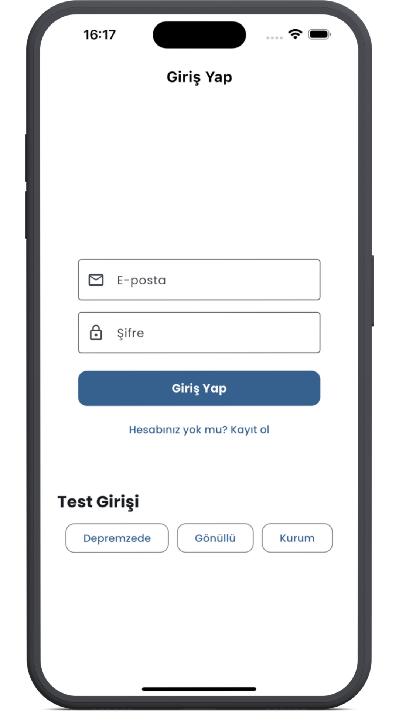
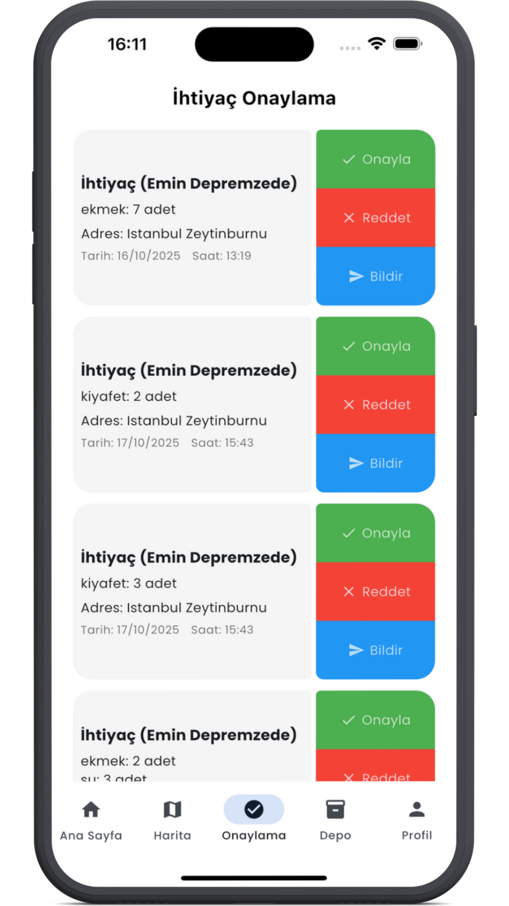
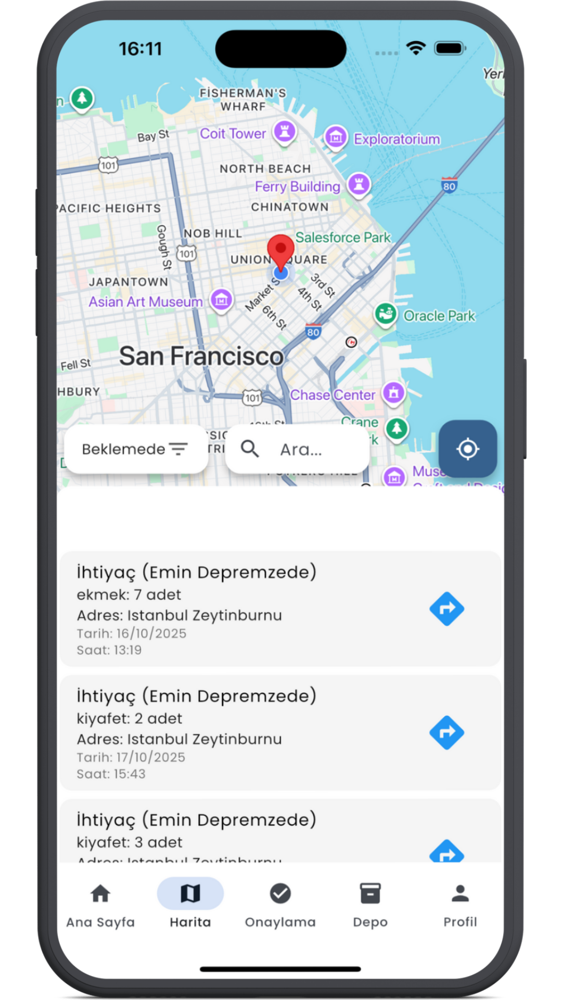
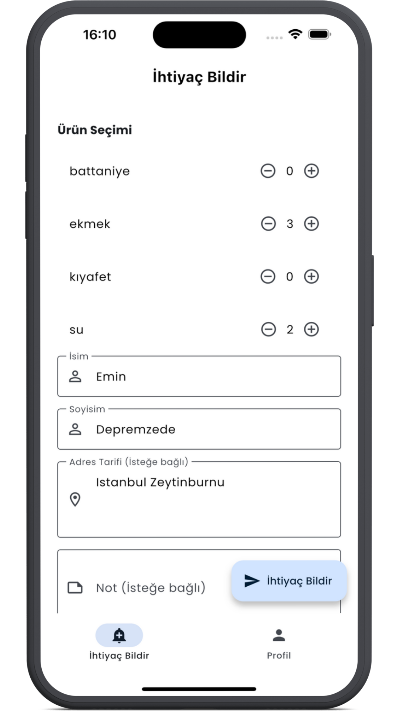
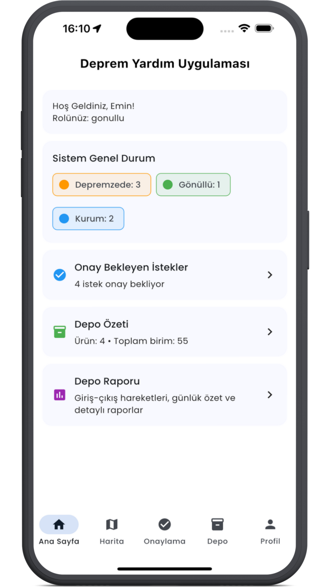
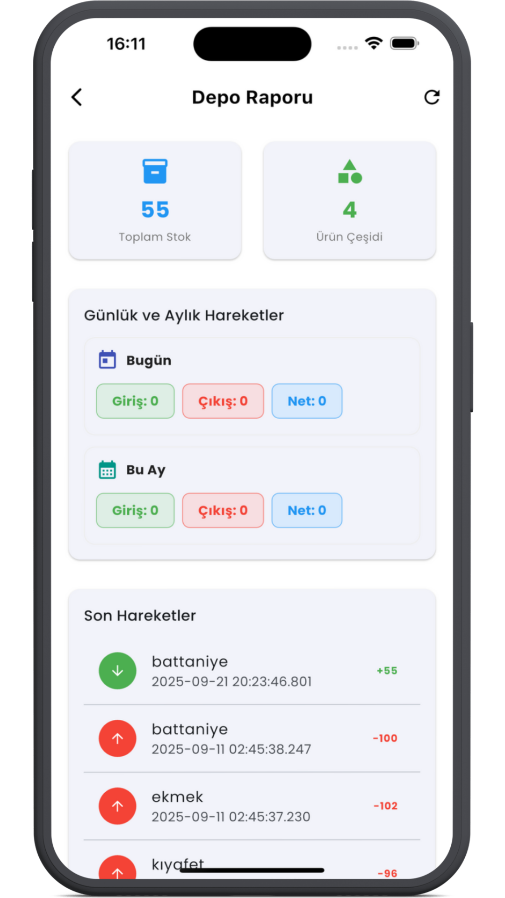
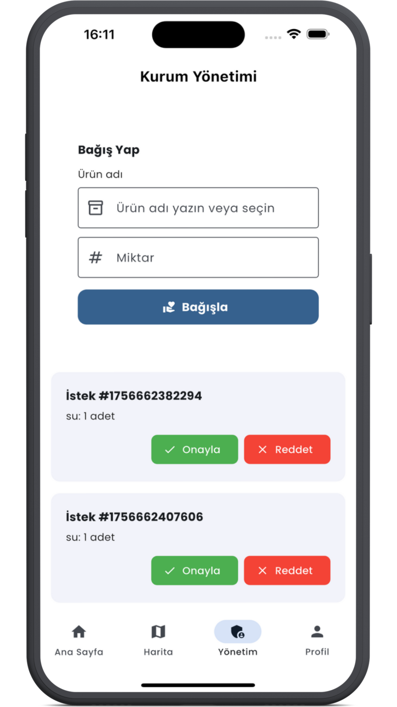
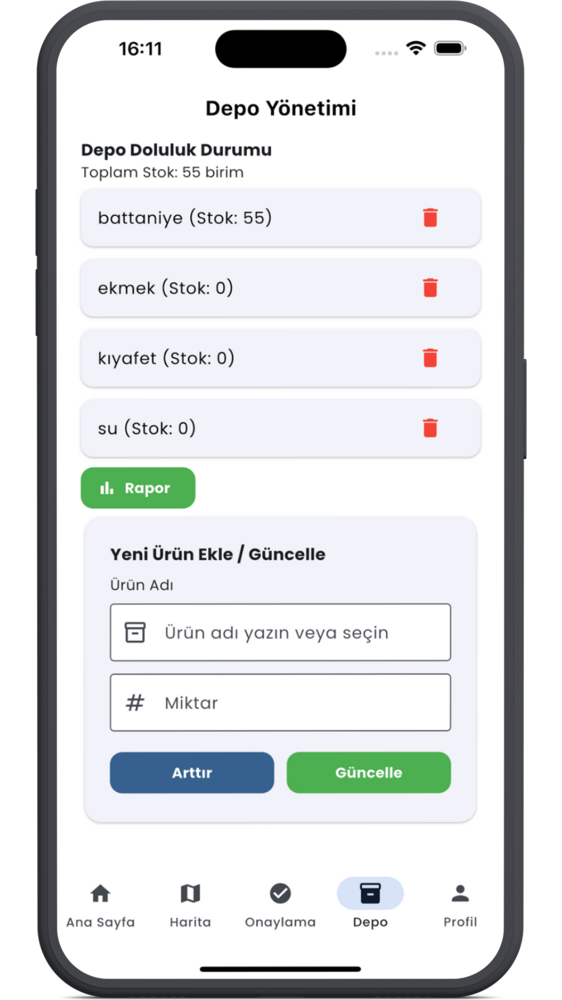

# Help Now - Deprem Yardım Uygulaması

Help Now, deprem durumlarında yardım koordinasyonunu kolaylaştırmak için geliştirilmiş bir mobil uygulamadır. Bu uygulama, afet durumlarında yardıma ihtiyacı olanlar ile yardım edebilecek kişileri bir araya getirmeyi amaçlamaktadır.

## Özellikler

- 📱 Kullanıcı kayıt ve giriş sxistemi
- 🗺️ Harita üzerinde yardım noktalarının görüntülenmesi
- 📍 Konum bazlı yardım talepleri oluşturma
- 📦 Depo ve yardım malzemesi takibi
- 🔔 Gerçek zamanlı bildirimler
- 📊 Yardım raporları ve istatistikler

## Teknolojiler

- Flutter SDK ^3.8.1
- Firebase (Authentication, Cloud Firestore)
- Google Maps Flutter
- Geolocator
- URL Launcher

## Ekran Görüntüleri

<p float="left">
  
  
  
  
  
  
  
  
  
</p>

### Gereksinimler

- Flutter SDK (^3.8.1)
- Dart SDK (en son versiyon)
- Android Studio veya VS Code
- Firebase hesabı
- Google Maps API anahtarı

### Kurulum

1. Projeyi klonlayın:
```bash
git clone https://github.com/meminglr/Help-Now.git
```

2. Bağımlılıkları yükleyin:
```bash
flutter pub get
```

3. Firebase yapılandırmasını tamamlayın:
   - Firebase Console'dan yeni bir proje oluşturun
   - Android ve iOS uygulamalarını kaydedin
   - Gerekli yapılandırma dosyalarını projeye ekleyin

4. Uygulamayı çalıştırın:
```bash
flutter run
```

## Katkıda Bulunma

Projeye katkıda bulunmak istiyorsanız:

1. Bu depoyu forklayın
2. Yeni bir dal oluşturun (`git checkout -b feature/YeniOzellik`)
3. Değişikliklerinizi commit edin (`git commit -m 'Yeni özellik eklendi'`)
4. Dalınıza push yapın (`git push origin feature/YeniOzellik`)
5. Bir Pull Request oluşturun

## Lisans

Bu proje [MIT lisansı](LICENSE) altında lisanslanmıştır.

## İletişim

Emin Güler - [@meminglr](https://github.com/meminglr)
